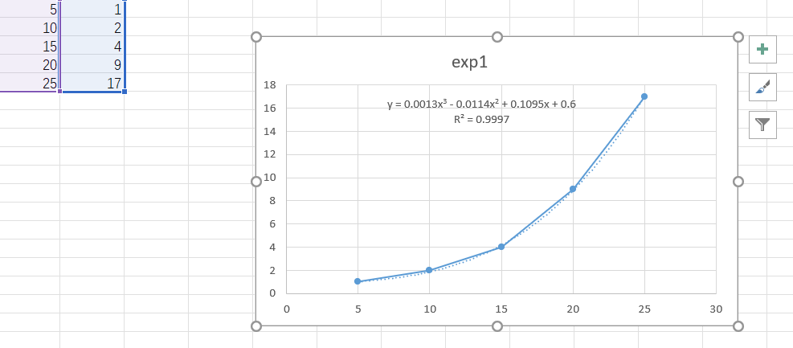
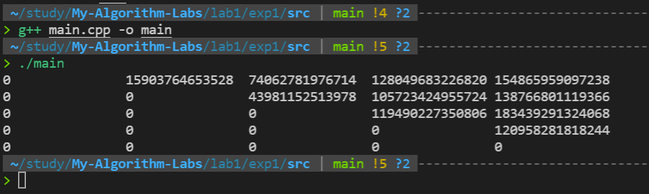
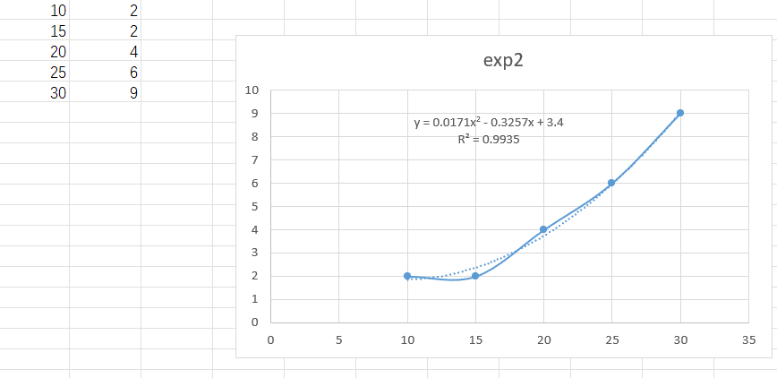

# 算法基础LAB1实验报告
- PB19000362
- 钟书锐

## EXP1:求矩阵链乘最优方案

### 1.实验设备和环境
- Legion Y7000P 2020H
- Intel(R) Core(TM) i7-10750H CPU @ 2.60GHz   2.59 GHz
- VMware® Workstation 15 Pro (15.5.6 build-16341506)
- 系统:ubuntu1~20.04
- gcc (Ubuntu 10.3.0-1ubuntu1) 10.3.0

### 2.实验内容
- 求矩阵链乘最优方案

### 3.方法和步骤
- 代码思路
- MatrixChain()
  - input
    - n:矩阵数目
    - p:存放矩阵的长宽(p.lenth=n+1)
    - m:保存代价m[i,j]
    - s:记录最优值m[i,j]的分割点k
  - output
    - 无
  - 功能
    - 将代价和分割点分别填入m,s
  - 实现
    - m为上三角矩阵，如下进行遍历
    ```
    for (int i = n; i >= 1; i--)
        for (int j = i; j <= n; j++)
    ```
    - 调用CalculateMin(i, j, p, m, s);

- CalculateMin()
  - input
    - i,j为要计算的代价的2端的标号
    - p:存放矩阵的长宽
    - m:保存代价m[i,j]
    - s:记录最优值m[i,j]的分割点k
  - output
    - 无
  - 功能
    - 将代价和分割点分别填入m[i,j],s[i,j]
  - 实现
    - 如下对分割点k进行遍历
    `for (int k = i + 1; k < j; k++)`
    - 计算curr
    `long long curr = m[i][k] + m[k + 1][j] + p[i - 1] * p[k] * p[j];`
    - 更新m[i][j]和s[i][j]
    ```
    if (curr < m[i][j])
        {
            m[i][j] = curr;
            s[i][j] = k;
        }
    ```

- PrintScheme()
  - input
    - i,j:要打印的范围
    - s:记录有最优值m[i,j]的分割点k
  - 功能
    - 将最优解输出
  - 实现
    - 递归调用PrintScheme()
    - i,j相等时输出对应的Ai
    - i,j不相等时分别对分割点前半部分和后半部分进行调用
    ```
    if (i == j)
        fresult << "A" << i;
    else
    {
        fresult << "(";
        PrintScheme(i, s[i][j], s);
        PrintScheme(s[i][j] + 1, j, s);
        fresult << ")";
    }
    ```

### 4.结果与分析
- 记录运行时间，画出曲线分析
  - 时间分别为1us，2us，5us，9us，16us，excel拟合如下
  - y = 0.0013x^3 - 0.0114x^2 + 0.1095x + 0.6
  - R² = 0.9997
    
  - 分析符合O(n^3)
- 仿照P214 图15-5，打印n=5时的结果并截图
    


## EXP2:求所有最长公共子序列

### 1.实验设备和环境
- Legion Y7000P 2020H
- Intel(R) Core(TM) i7-10750H CPU @ 2.60GHz   2.59 GHz
- VMware® Workstation 15 Pro (15.5.6 build-16341506)
- 系统:ubuntu1~20.04
- gcc (Ubuntu 10.3.0-1ubuntu1) 10.3.0

### 2.实验内容
- 求所有最长公共子序列

### 3.方法和步骤
- 代码思路
- Lcs()
  - input
    - n:X和Y2个字符串具有的相同长度
    - X,Y:求所有最长公共子序列的2个源字符串
    - c:(i,j)存储Xi和Yj的LCS长度
  - output
    - 无
  - 功能
    - 通过输入的字符串填充c，其中c(i,j)存储Xi和Yj的LCS长度
  - 实现
    - 通过循环遍历所有元素
    ```
    for (int i = 1; i <= n; ++i)
        for (int j = 1; j <= n; ++j)
        
    ```
    - 如果最后2个字符相同，求子问题c[i - 1][j - 1]
    - 否则，求解子问题c[i - 1][j], c[i][j - 1]，取其中较大的为c[i][j]
    ```
    if (X[i - 1] == Y[j - 1])
        c[i][j] = c[i - 1][j - 1] + 1;
    else
       c[i][j] = max(c[i - 1][j], c[i][j - 1]);
    ```
- Trace()
  - input
    - i,j:分别标记的X，Y子串的尾端的地点
    - X,Y:求所有最长公共子序列的2个源字符串
    - c:(i,j)存储Xi和Yj的LCS长度
    - Lcs_str：存储这次trace的结果(最长子序列)
  - output
    - 无
  - 功能
    - 找到最长子序列，放入Lcs_str
  - 实现
    - 通过递归回溯实现
    - 尾端相同Lcs_str前面添加对应的字符
    ```
    if (X[i - 1] == Y[j - 1])
        {
            Lcs_str = X[i - 1] + Lcs_str;
            --i;
            --j;
        }
    ```
    - `c[i - 1][j] == c[i][j - 1]`时产生分支
    ```
    if (c[i - 1][j] > c[i][j - 1])
        --i;
    else if (c[i - 1][j] < c[i][j - 1])
        --j;
    else
        {
            Trace(i - 1, j, X, Y, c, Lcs_str);
            Trace(i, j - 1, X, Y, c, Lcs_str);
            return;
        }
    ```
    
### 4.结果与分析
- 记录运行时间，画出曲线分析
  - 时间分别为2us，2us，4us，6us，9us，excel拟合如下
  - y = 0.0171x^2 - 0.3257x + 3.4
  - R² = 0.9935
    
  - 分析符合O(n^2)
