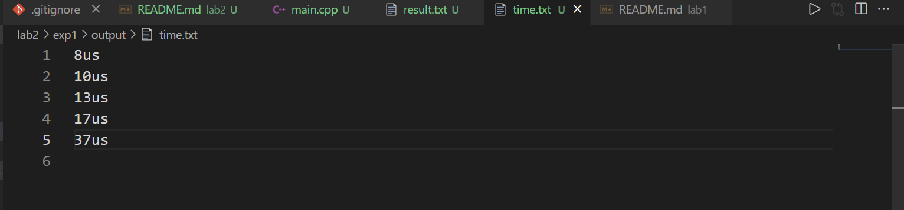
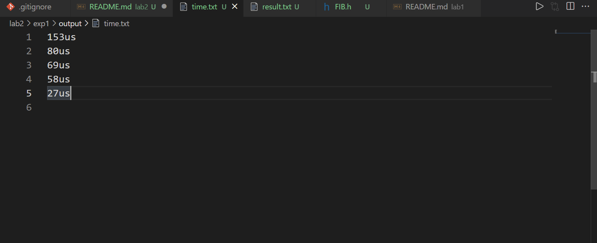
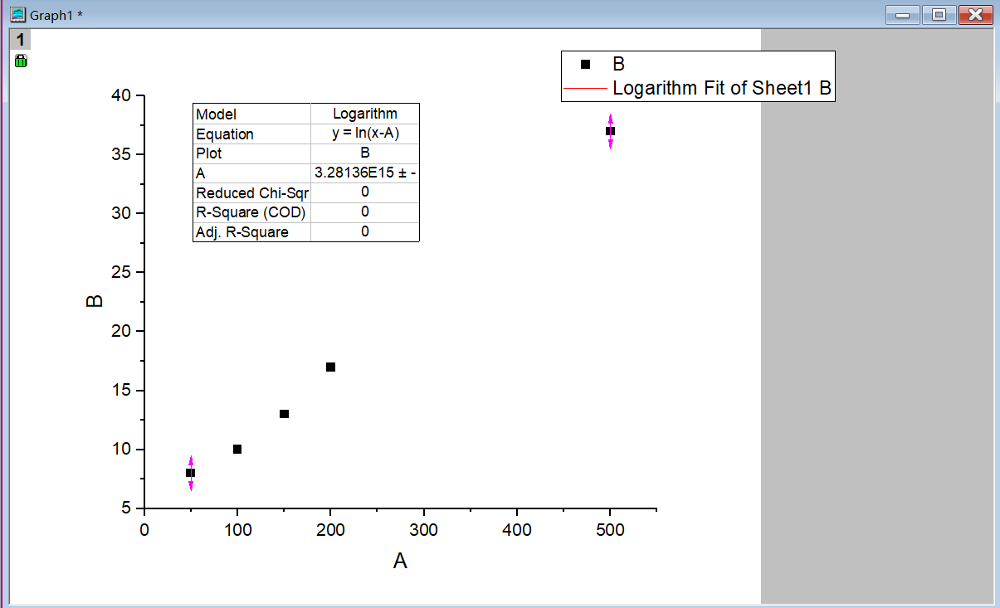
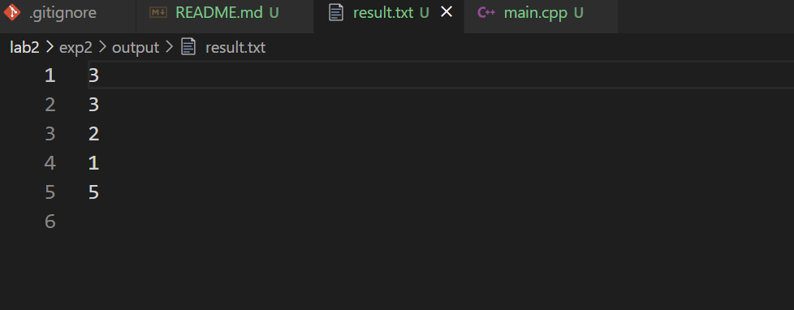
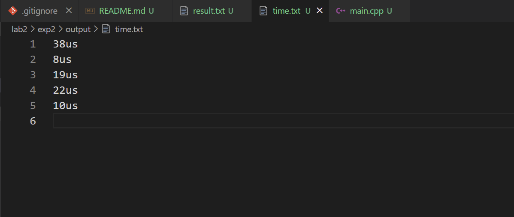

# 算法基础LAB2实验报告
- PB19000362
- 钟书锐

## EXP1:斐波那契堆

### 1.实验设备和环境
- Legion Y7000P 2020H
- Intel(R) Core(TM) i7-10750H CPU @ 2.60GHz   2.59 GHz
- VMware® Workstation 15 Pro (15.5.6 build-16341506)
- 系统:ubuntu1~20.04
- gcc (Ubuntu 10.3.0-1ubuntu1) 10.3.0
- COLLECT_GCC=g++
- COLLECT_LTO_WRAPPER=/usr/lib/gcc/x86_64-linux-gnu/10/lto-wrapper
- OFFLOAD_TARGET_NAMES=nvptx-none:amdgcn-amdhsa:hsa
- OFFLOAD_TARGET_DEFAULT=1
- Target: x86_64-linux-gn

### 2.实验内容
- 斐波那契堆

### 3.方法和步骤
```CPP
//斐波那契结点
struct FibNode
{
    int key;         // 关键字(键值)
    int degree;      // 度数
    FibNode *left;   // 左兄弟
    FibNode *right;  // 右兄弟
    FibNode *child;  // 第一个孩子节点
    FibNode *parent; // 父节点
    bool marked;     // 是否被删除第一个孩子
};

//斐波那契堆
struct FibHeap
{
    int keyNum;     //堆中结点个数
    int maxDegree;  //最大度
    FibNode *min;   //最小堆，根结点
    FibNode **cons; //指向最大度的内存区域
};
//初始化一个空的FibHeap
FibHeap *FibHeapMake();

//初始化一个空的FibNode
FibNode *FibNodeMake();

// 将node从双链表移除
void RemoveNode(FibNode *node);

// 将双向链表b链接到双向链表a的后面
void AddNode(FibNode *a, FibNode *b);

//结点node插入FibHeap中
int InsertNode(FibHeap *heap, FibNode *node);

//将值插入FibHeap
int InsertKey(FibHeap *heap, int key);

//将数组内值插入Fibonacci Heap
void InsertKeys(FibHeap *heap, int keys[], int keyNum);

//返回 heap最小值
int MINIMUM(FibHeap *heap);

//移除最小结点
FibNode *RemoveMin(FibHeap *heap);

//开辟FpConsolidate函数哈希所用空间
void FibConsMake(FibHeap *heap);

//将x根结点链接到y根结点
void FibHeapLink(FibHeap *heap, FibNode *x, FibNode *y);

//合并左右相同度数的二项树
void FibHeapConsolidate(FibHeap *heap);

//抽取最小结点
FibNode *ExtractMin(FibHeap *heap);

//修改度数
void renewDegree(FibNode *parent, int degree);

//切断x与父节点y之间的链接，使x成为一个根
void FibHeapCut(FibHeap *heap, FibNode *x, FibNode *y);

//级联剪切
void CascadingCut(FibHeap *heap, FibNode *y);

//减小一个关键字
void FibHeapDecrease(FibHeap *heap, FibNode *x, int key);

//删除结点
int FibHeapDelete(FibHeap *heap, FibNode *x);

//递归搜索
FibNode *FibNodeSearch(FibNode *x, int key);

//堆内搜索关键字
FibNode *FibHeapSearch(FibHeap *heap, int key);

//销毁堆
void FibHeapDestory(FibHeap *heap);

//合并堆
FibHeap *FibHeapUnion(FibHeap *heap1, FibHeap *heap2);

```
### 4.结果与分析
- result

- time

- 拟合

- Model	Logarithm
- Equation	y = ln(x-A)
- Plot	B
- A	3.28136E15 ± --
- 显然时间复杂度符合O(lgx)

## EXP2:朋友圈

### 1.实验设备和环境
- Legion Y7000P 2020H
- Intel(R) Core(TM) i7-10750H CPU @ 2.60GHz   2.59 GHz
- VMware® Workstation 15 Pro (15.5.6 build-16341506)
- 系统:ubuntu1~20.04
- gcc (Ubuntu 10.3.0-1ubuntu1) 10.3.0
- COLLECT_GCC=g++
- COLLECT_LTO_WRAPPER=/usr/lib/gcc/x86_64-linux-gnu/10/lto-wrapper
- OFFLOAD_TARGET_NAMES=nvptx-none:amdgcn-amdhsa:hsa
- OFFLOAD_TARGET_DEFAULT=1
- Target: x86_64-linux-gn

### 2.实验内容
- 朋友圈

### 3.方法和步骤
```CPP
class DisjSet
{
private:
    vector<int> parent;
    vector<int> rank; // 秩

public:
    DisjSet(int max_size)
        : parent(vector<int>(max_size)), rank(vector<int>(max_size, 0))
    {
        for (int i = 0; i < max_size; ++i)
            parent[i] = i;
    }

    int find(int x)
    {
        if (x == parent[x])
            return x;
        else
        {
            parent[x] = find(parent[x]);
            return parent[x];
        }
    }

    void to_union(int x1, int x2)
    {
        int f1 = find(x1);
        int f2 = find(x2);
        if (rank[f1] > rank[f2])
            parent[f2] = f1;
        else
        {
            parent[f1] = f2;
            if (rank[f1] == rank[f2])
                ++rank[f2];
        }
    }

    bool is_same(int e1, int e2)
    {
        return find(e1) == find(e2);
    }
};
```

### 4.结果与分析
- result

- time

- 显然时间复杂度符合O(1)

