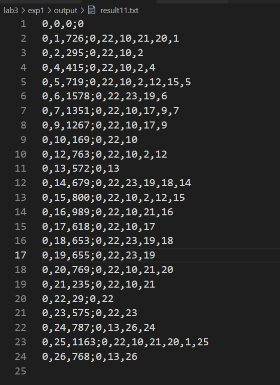
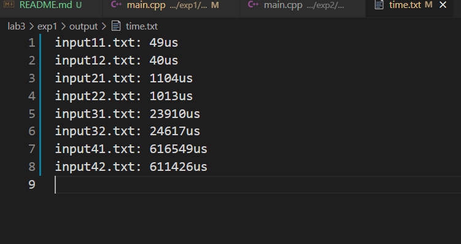
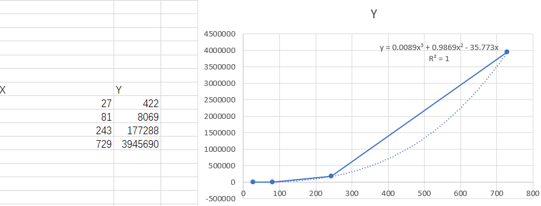
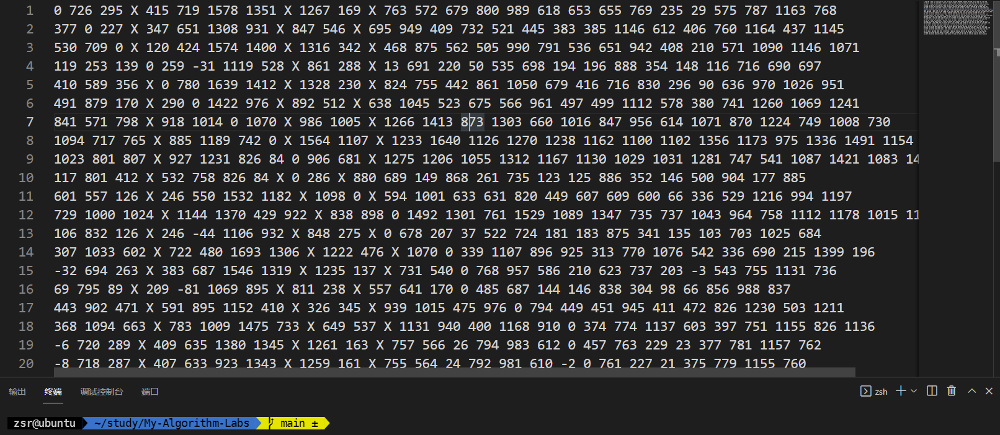
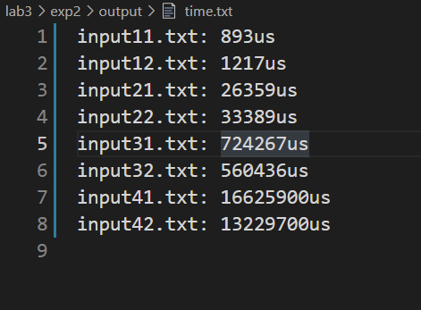
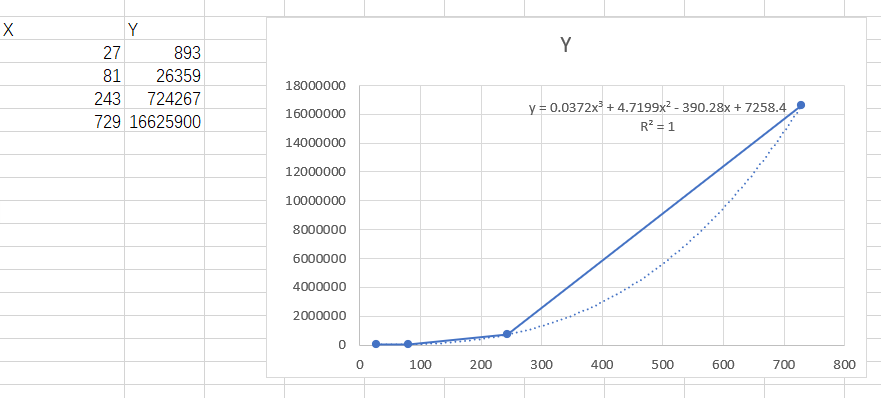

# 算法基础LAB3实验报告
- PB19000362
- 钟书锐

## EXP1:Bellman-Ford算法

### 1.实验设备和环境
- Legion Y7000P 2020H
- Intel(R) Core(TM) i7-10750H CPU @ 2.60GHz   2.59 GHz
- VMware® Workstation 15 Pro (15.5.6 build-16341506)
- 系统:ubuntu1~20.04
- gcc (Ubuntu 10.3.0-1ubuntu1) 10.3.0
- COLLECT_GCC=g++
- COLLECT_LTO_WRAPPER=/usr/lib/gcc/x86_64-linux-gnu/10/lto-wrapper
- OFFLOAD_TARGET_NAMES=nvptx-none:amdgcn-amdhsa:hsa
- OFFLOAD_TARGET_DEFAULT=1
- Target: x86_64-linux-gn

### 2.实验内容
- Bellman-Ford算法
- 实现求单源最短路径的Bellman-Ford算法。

### 3.方法和步骤
- 以下为bellman_ford核心算法，源点为0号结点
  - 以结点数目作为参数， `dis[]`为到源点的距离，`graph[][]`为图邻接矩阵， `road[]`记录前驱
  - 遍历结点-1次，每次尝试对每条边都尝试进行松弛操作`dis[j] = dis[i] + graph[i][j];`
```CPP
void bellman_ford(int n)
// Bellman_Ford算法
// input:结点数目
{
    dis[0] = 0; // 初始可达0
    for (int k = 0; k < n; k++)
        for (int i = 0; i < n; i++)
        {
            for (int j = 0; j < n; j++)
            {
                //进行松弛操作
                if (graph[i][j] != INT_MAX && dis[i] != INT_MAX && dis[j] > dis[i] + graph[i][j])
                {
                    dis[j] = dis[i] + graph[i][j];
                    road[j] = i;
                }
            }
        }
}
```
- 以下为output_road路径输出的代码
  - 函数采用递归调用实现
  - 传入参数有j和flag，j是结点标号，标识最后一个结点
  - 调用output_road(j, 1)能够从源点0输出到j号结点
```
cpp
void output_road(int j, int flag)
{
    if (j != 0)
        output_road(road[j], 0);
    if (flag == 0)
        fresult << j << ",";
    else
        fresult << j;
}
```
- 主函数实现总体功能
  
```cpp
int a, b;//分别用来指定文件名的2个维度
const int N[5] = {0, 27, 81, 243, 729}; //顶点数
int graph[MAX_N][MAX_N];                //邻接矩阵存储图
int dis[MAX_N];                         //存储所有顶点到源点的距离
int road[MAX_N];                        //存储每个点的前驱`
```
```cpp
int main()
{
    clock_t start, end;
    ftime.open("../output/time.txt", ios::out);
    for (a = 1; a <= 4; a++)
    {
        for (b = 1; b <= 2; b++)
        {
            string filename = "../input/input" + to_string(a) + to_string(b) + ".txt";
            fin = fopen(filename.data(), "r");

            fresult.open("../output/result" + to_string(a) + to_string(b) + ".txt", ios::out);

            //初始化
            memset(graph, 0, sizeof(graph));
            memset(road, 0, sizeof(road));
            for (int i = 0; i < N[a]; i++)
                dis[i] = INT_MAX;
            dis[0] = 0;

            //读取输入
            for (int i = 0; i < N[a]; i++)
                for (int j = 0; j < N[a]; j++)
                {
                    int tempt;
                    fscanf(fin, "%d,", &tempt);
                    if (tempt != 0)
                        graph[i][j] = tempt;
                    else if (i == j)
                        graph[i][j] = 0;
                    else
                        graph[i][j] = INT_MAX;
                }
            start = clock();
            // bellman_ford算法
            bellman_ford(N[a]);
            end = clock();

            //输出
            ftime << "input" + to_string(a) + to_string(b) + ".txt: ";
            ftime << long(end - start) / (CLOCKS_PER_SEC / 1000000) << "us" << endl;
            for (int j = 0; j < N[a]; j++)
            {
                if (dis[j] != INT_MAX)
                {
                    fresult << "0"
                            << ",";
                    fresult << j
                            << ",";
                    fresult << dis[j]
                            << ";";
                    output_road(j, 1);
                    fresult << endl;
                }
            }
            fresult.close();
        }
    }
}
```

### 4.结果与分析
- result11.txt为例

- time

- 分析bellman_ford算法的理论时间复杂度O(V*E)
  - 因为算法进行V-1次迭代
  - 每次遍历所有的边进行松弛操作
  - V是结点个数
  - E是图的边的个数
- 但是因为实验输入文件类似邻接矩阵
  - 所以以邻接矩阵处理时，遍历所有边需要O(V^2)时间
  - 所以实际时间复杂度接近O(V^3)
- 

## EXP2:Johnson算法

### 1.实验设备和环境
- Legion Y7000P 2020H
- Intel(R) Core(TM) i7-10750H CPU @ 2.60GHz   2.59 GHz
- VMware® Workstation 15 Pro (15.5.6 build-16341506)
- 系统:ubuntu1~20.04
- gcc (Ubuntu 10.3.0-1ubuntu1) 10.3.0
- COLLECT_GCC=g++
- COLLECT_LTO_WRAPPER=/usr/lib/gcc/x86_64-linux-gnu/10/lto-wrapper
- OFFLOAD_TARGET_NAMES=nvptx-none:amdgcn-amdhsa:hsa
- OFFLOAD_TARGET_DEFAULT=1
- Target: x86_64-linux-gn

### 2.实验内容
- Johnso算法
- 实现求所有点对最短路径的Johnson算法。

### 3.方法和步骤
- 以下为bellman_ford核心算法，源点为0号结点
  - 和exp1类似，因为不需要输出路径，不再需要road
  - 以结点数目作为参数， `dis[]`为到源点的距离，`graph[][]`为图邻接矩阵
  - 遍历结点-1次，每次尝试对每条边都尝试进行松弛操作`dis[j] = dis[i] + graph[i][j];`
```CPP
void bellman_ford(int n)
// Bellman_Ford算法
// input:结点数目
{
    dis[0] = 0; // 初始可达0
    for (int k = 0; k < n; k++)
        for (int i = 0; i < n; i++)
        {
            for (int j = 0; j < n; j++)
            {
                //进行松弛操作
                if (graph[i][j] != INT_MAX && dis[i] != INT_MAX && dis[j] > dis[i] + graph[i][j])
                {
                    dis[j] = dis[i] + graph[i][j];
                }
            }
        }
}
```

- 以下为Dijkstra核心算法
  - 以结点数目和源点标号作为参数， `dij_dis[]`为到源点的距离，`graph[][]`为图邻接矩阵
  - `cost[][]`为代价矩阵
  - Dijkstra核心算法首先初始化`dij_dis[]`到源点的距离,`if_sure[]` 标记确定的点
  - 循环n-1次，每次d找到ij_dis中未标记点中的最小值，更新`if_sure`，`更新dij_dis[]`
```cpp
void dijkstra(int n, int i)
// Dijkstra算法
// input:结点数目,源点标号
{
    //初始化 dij_dis 存储所有点到源点最短距离
    int dij_dis[n + 1];
    for (int j = 1; j <= n; j++)
    {
        dij_dis[j] = graph_new[i][j];
        cost[i][j] = graph[i][j];
    }

    //初始化 if_sure 标记确定的点
    int if_sure[n + 1];
    for (int j = 1; j <= n; j++)
        if_sure[j] = 0;
    if_sure[i] = 1;

    int min; //用来寻找ij_dis最小的点
    int u;   //每次找到的ij_dis最小的点

    for (int j = 1; j < n; j++)
    //循环n-1次
    {
        min = INT_MAX;
        for (int k = 1; k <= n; k++)
        // 找到ij_dis中未标记点中的最小值
        {
            if (if_sure[k] == 0 && dij_dis[k] < min)
            {
                min = dij_dis[k];
                u = k;
            }
        }
        if_sure[u] = 1;

        for (int m = 1; m <= n; m++)
        //更新dij_dis
        {
            if (graph[u][m] < INT_MAX)
            {
                if (dij_dis[m] > dij_dis[u] + graph_new[u][m])
                {
                    dij_dis[m] = dij_dis[u] + graph_new[u][m];
                    cost[i][m] = cost[i][u] + graph[u][m];
                }
            }
        }
    }
}
```


- 以下为主函数调用bellman_ford(int n)，dijkstra(int n, int i)实现所要求功能
  - 打开文件
  ```cpp
  string filename = "../input/input" + to_string(a) + to_string(b) + ".txt";
            fin = fopen(filename.data(), "r");

            fresult.open("../output/result" + to_string(a) + to_string(b) + ".txt", ios::out);

  ```
  - 初始化
  ```cpp
            //初始化
            memset(graph, 0, sizeof(graph));     //初始化graph
            memset(graph_new, 0, sizeof(graph)); //初始化graph_new
            for (int i = 0; i <= N[a]; i++)      //初始化cost
            {
                for (int j = 0; j <= N[a]; j++)
                {
                    if (i == j)
                        cost[i][j] = 0;
                    else
                        cost[i][j] = INT_MAX;
                }
            }
            for (int i = 0; i <= N[a]; i++) //初始化dis
                dis[i] = INT_MAX;

  ```
  - 读入数据
  ```cpp
            for (int i = 1; i <= N[a]; i++)
                for (int j = 1; j <= N[a]; j++)
                {
                    int tempt;
                    fscanf(fin, "%d,", &tempt);
                    if (tempt != 0)
                        graph[i][j] = tempt;
                    else if (i == j)
                        graph[i][j] = 0;
                    else
                        graph[i][j] = INT_MAX;
                }
  ```
  - 虚拟结点0号结点
  ```cpp
  //创造虚拟的0号结点
            for (int j = 0; j <= N[a]; j++)
            {
                graph[0][j] = 0;
                graph[j][0] = INT_MAX;
            }
  ```
  - 调用bellman_ford(N[a] + 1)之后进行rewrite操作更新不同节点 `graph_new[][]`
  ```cpp
   // bellman_ford算法
            bellman_ford(N[a] + 1);
   // reweight操作
            for (int i = 1; i <= N[a]; i++)
                for (int j = 1; j <= N[a]; j++)
                {
                    if (graph[i][j] != INT_MAX)
                        graph_new[i][j] = graph[i][j] + dis[i] - dis[j];
                    else
                        graph_new[i][j] = graph[i][j];
                }
  ```
  - 对每个点进行dijkstra算法
  ```cpp
   //对每个点进行dijkstra算法
            for (int i = 1; i <= N[a]; i++)
                dijkstra(N[a], i);
            end = clock();

  ```


  ### 4.结果与分析
- result

- time

- 如果使用 std::priority_queue 优化的 Dijkstra 则总复杂度为 O(V(E+V)logE)。
- 这里没使用优先队列优化的Dijkstra算法
- 所以时间复杂度接近O（V^3）
- 