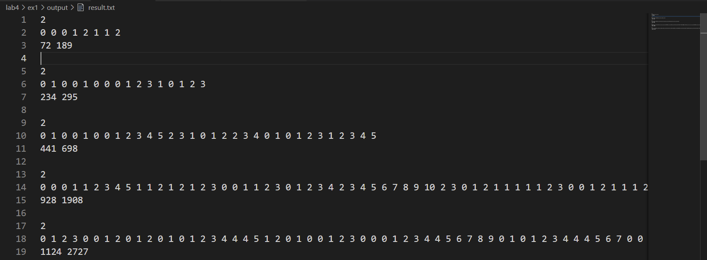
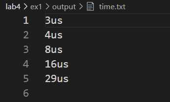
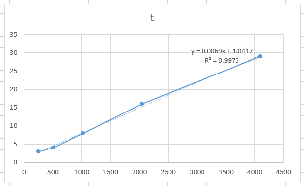
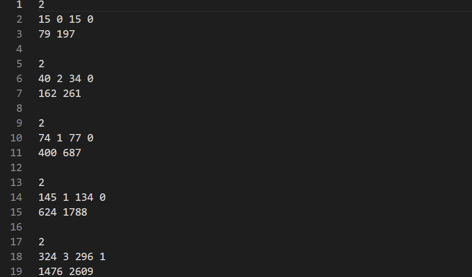
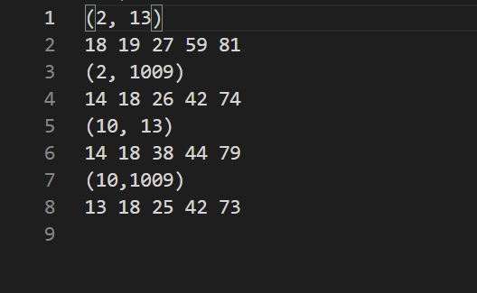
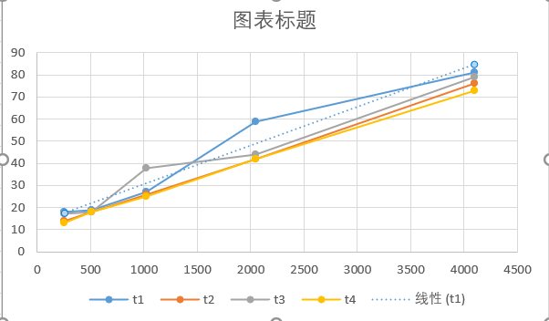

# 算法基础 LAB3 实验报告

- PB19000362
- 钟书锐

## EXP1:KMP 算法

### 1.实验设备和环境

- Legion Y7000P 2020H
- Intel(R) Core(TM) i7-10750H CPU @ 2.60GHz 2.59 GHz
- VMware® Workstation 15 Pro (15.5.6 build-16341506)
- 系统:ubuntu1~20.04
- gcc (Ubuntu 10.3.0-1ubuntu1) 10.3.0
- COLLECT_GCC=g++
- COLLECT_LTO_WRAPPER=/usr/lib/gcc/x86_64-linux-gnu/10/lto-wrapper
- OFFLOAD_TARGET_NAMES=nvptx-none:amdgcn-amdhsa:hsa
- OFFLOAD_TARGET_DEFAULT=1
- Target: x86_64-linux-gn

### 2.实验内容

- KMP 算法
- 给定文本串 T、模式串 P，T 的长度为 n，P 的长度为 m，采用 KMP 算法进行字符串匹配。
- (n, m)共有 5 组取值，分别为: (28，23), (29，24), (210,25), (211,26), (212,27)，见/ex1/input/4_1_input.txt。
- 输出所有匹配的 T 的开始下标和 Π 的函数值，记录找到所有匹配的时间，并画出曲线分析。

### 3.方法和步骤

- 算法核心代码，KPMATCH

```cpp

void KMPMatch()
{
    int n = strlen(text + 1);
    int m = strlen(pattern + 1);
    ComputePrefixFuction();
    int q = 0;
    for (int i = 1; i <= n; i++)
    {
        while (q > 0 && pattern[q + 1] != text[i])
            q = pi[q];
        if (pattern[q + 1] == text[i])
            q++;
        if (q == m)
        //匹配成功
        {
            count++;
            begin_pos[count] = i - m + 1;
            q = pi[q];
        }
    }
}
```

- 算法核心代码，KPMATCH 计算 pi 函数

```cpp
void ComputePrefixFuction()
{
    for (int i = 0; i < 200; i++)
        pi[i] = 0;
    pi[1] = 0;
    int m = strlen(pattern + 1);
    int k = 0;
    for (int q = 2; q < m + 1; q++)
    {
        while (k > 0 && pattern[k + 1] != pattern[q])
            k = pi[k];
        if (pattern[k + 1] == pattern[q])
            k++;
        pi[q] = k;
    }
}
```

### 4.结果与分析

- 结果
  
- 时间
  
- 考虑到算法总复杂度是 O(m+n)，n 比 m 大得多，不妨以 n 为横坐标，直接画总运行时间的曲线
- 
- y = 0.0069x + 1.0417
- R² = 0.9975
- 符合理论的线性时间复杂度

## EXP2:Rabin-Karp 算法

### 1.实验设备和环境

- Legion Y7000P 2020H
- Intel(R) Core(TM) i7-10750H CPU @ 2.60GHz 2.59 GHz
- VMware® Workstation 15 Pro (15.5.6 build-16341506)
- 系统:ubuntu1~20.04
- gcc (Ubuntu 10.3.0-1ubuntu1) 10.3.0
- COLLECT_GCC=g++
- COLLECT_LTO_WRAPPER=/usr/lib/gcc/x86_64-linux-gnu/10/lto-wrapper
- OFFLOAD_TARGET_NAMES=nvptx-none:amdgcn-amdhsa:hsa
- OFFLOAD_TARGET_DEFAULT=1
- Target: x86_64-linux-gn

### 2.实验内容

- Rabin-Karp 算法
- 给定文本串 T、模式串 P，T 的长度为 n，P 的长度为 m，采用 Rabin-Karp 算法进行字符串匹配。
- (n, m)共有 5 组取值，分别为: (28，23), (29，24), (210,25), (211,26), (212,27)，见/ex2/input/4_2_input.txt。
- 基数 d 和素数 q 共 4 组取值，(d,q)分别为：(2,13),(2,1009),(10,13),(10,1009)
- 输出所有匹配的 T 的开始下标和伪命中次数，记录找到所有匹配的时间，并画出曲线分析。其中，伪命中指 Hash 值相等但并不匹配的情况。

### 3.方法和步骤

- 算法核心代码，RKMATCH
- 参数为 d,q 和存放伪命中数目的索引 index
- 注意函数调用了 `int h = mod(d, m - 1, q);`来求`pow(d, m - 1) % q`
- 因为`pow(d, m - 1)`太大，即使使用 long long 类型也很难
- 所以单独使用了 mod 函数

```cpp
void RKMATCH(int d, int q, int index)
//(d, q) 分别为：(2, 13), (2, 1009), (10, 13), (10, 1009)
{
    int t[5000];
    int n = strlen(text + 1);
    int m = strlen(pattern + 1);
    // int h = (long long)pow(d, m - 1) % q;
    int h = mod(d, m - 1, q);
    int p = 0;
    count = 0;
    false_hit[index] = 0;
    for (int i = 0; i < 5000; i++)
    {
        t[i] = 0;
    }
    for (int i = 1; i <= m; i++)
    {
        p = ((d * p + pattern[i]) % q + q) % q;
        t[0] = ((d * t[0] + text[i]) % q + q) % q;
    }
    for (int s = 0; s <= n - m; s++)
    {
        if ((p - t[s]) % q == 0)
        {
            if (compare_text(m, s))
            {
                count++;
                begin_pos[count] = s + 1;
            }
            else
                false_hit[index]++;
        }

        if (s < n - m)
            t[s + 1] = (((d * (t[s] - text[s + 1] * h) + text[s + m + 1]) % q) + q) % q;
    }
}
```

- 算法核心代码，mod 计算 `pow(d, m - 1) % q`

```cpp
long mod(long n, long k, long m)
//核心算法幂模运算
//研究指数k的二进制表示
//计算 （n^k)%m
{
    long mod = 1;
    long base = n;
    long res = 1;
    if (n > m)
    //先减小以下n的值,不然容易超long的范围
    {
        n = n % m;
        base = n;
    }
    else if (n == m)
    {
        return 1;
    }
    while (k != 0)
    {
        if ((k & 1) == 1)
        { //取k的二进制最后一位,若为1,则表示存在该项
            mod *= (base % m);
            if (mod == 0)
            {
                return 0; //只要有一个数模为0,直接返回0
            }
            else if (mod > m)
            {
                mod %= m; //若模大于除数,则可以进行一次求模
            }
            base = base % m; // base求余,根据余数来算模,以免超出long的范围
        }
        base *= base; //将余数进行平方来算模,能减小数的大小
        base = base % m;
        k >>= 1; //将k的二进制往右移动一位
    }
    return mod;
}
```

### 4.结果与分析

- 结果
  
- 时间
  
- 最坏复杂度是 O(mn)，考虑到 n 比 m 大得多，这里可以直接以 n 作横坐标
- 

- t1 ：y = 0.0175x + 13 R² = 0.9549
- t2 : y = 0.0161x + 9.5833 R² = 0.9998
- t3 : y = 0.0159x + 13.958 R² = 0.9669
- t4 : y = 0.0156x + 9.5 R² = 0.9995
- 符合理论的线性时间复杂度
